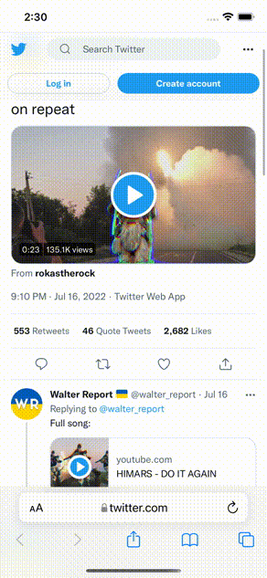

# SwiftyYTDL

Thin SwiftUI wrapper around [yt-dlp](https://github.com/yt-dlp/yt-dlp) - popluar Python module for downloading stuff of Youtube, Twtitter, Instagram, TikTok and others.

Depends on [PythonKit](https://github.com/pvieito/PythonKit) and pre-built Python static libraries from [Python Apple Support](https://github.com/beeware/Python-Apple-support) project. Inspired by [YoutubeDL for iOS](https://github.com/kewlbear/YoutubeDL).

All downloaded videos are added to "SwiftyYTDL" album in iOS Photo Library.



## Build

To download the dependencies run `bootstrap.sh` script from the sources root directory.

```sh
./bootstrap.sh
````

After that just use Xcode to open `SwiftyYTDL.xcodeproj` and run the project.

```sh
open SwiftyYTDL.xcodeproj
```

## yt-dlp

Check version:

```sh
cd Thirdparties && python3
```

```sh
>>> import sys
>>> sys.path.append('yt-dlp')
>>> import yt_dlp
>>> yt_dlp.version.__version__
```
